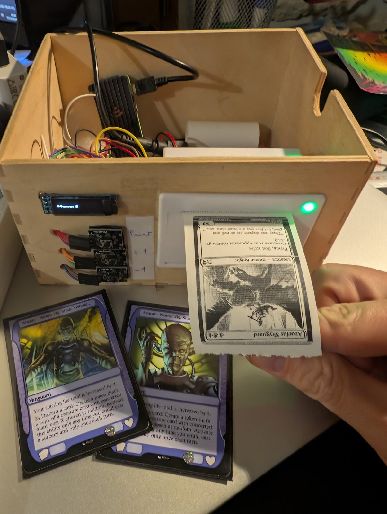
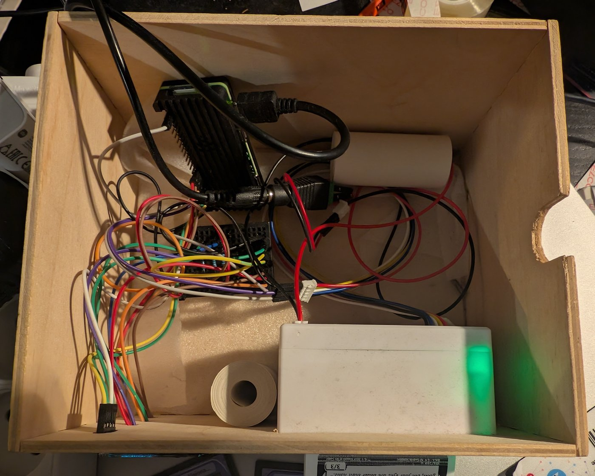

# Momir Basic Thermal Printer

A Raspberry Pi-powered thermal printer that plays [Momir Basic](https://mtg.fandom.com/wiki/Momir_Basic): press a button to set your mana value, then print a random creature card at that cost.

<p align="center">
  
</p>

> This is a fork of [oboyone/mb_thermal_printer](https://github.com/oboyone/mb_thermal_printer), the original project and wiring design. Unofficial fan project: not affiliated with or endorsed by Wizards of the Coast or Scryfall. Card images belong to their owners; this repository does not contain any, you download them yourself from [Scryfall](https://scryfall.com/).

---

## How it works

1. Download the [Scryfall bulk data](https://scryfall.com/docs/api/bulk-data) (one card per Oracle ID) and keep the creature cards
2. Download their card images from Scryfall and convert them to monochrome BMP for the thermal printer
3. Run `momir_basic.py` on the Pi: use two buttons to set the CMC, press a third to print a random card

---

## Hardware

| Qty | Component |
|-----|-----------|
| 1 | Raspberry Pi 4 (or Raspberry Pi Zero 2 W) |
| 1 | QR204 Thermal Printer |
| 1 | 0.91" OLED 128×32 I²C display (SSD1306) |
| 3 | KY-004 push button |
| 3 | 1 kΩ resistor *(optional — extends button lifetime; place between 3.3 V and the button)* |
| 1 | 12 V female 2.1 mm × 5.5 mm DC power jack adapter |
| 1 | 9 V 2 A male DC power adapter |
| 1 | Power cable for the Raspberry Pi |
| 1 | Soldering breadboard |
| 1 | 32 GB micro SD card |
| — | Dupont cables |

---

## Wiring


> The diagram was made with a Raspberry Pi 4. The GPIO pinout is identical on the Raspberry Pi Zero 2 W — the same connections apply. In the diagram, "Tx to pin 8" / "Rx to pin 10" name the **Pi** pins: see the UART note below.

All pins use BOARD numbering (physical pin numbers, not BCM GPIO numbers).

| Component | Pi physical pin | Notes |
|-----------|----------------|-------|
| Button UP (increase CMC) | Pin 11 | Default: pull-down (PUD_DOWN), the button connects the pin to 3.3 V. See *Buttons* below if yours behave the other way round |
| Button DOWN (decrease CMC) | Pin 13 | Same wiring |
| Button PRINT | Pin 15 | Same wiring |
| OLED SDA | Pin 3 (SDA1) | I²C address 0x3C |
| OLED SCL | Pin 5 (SCL1) | |
| OLED VCC | Pin 1 (3.3 V) | |
| OLED GND | Pin 6 (GND) | |
| Pi TX (GPIO14) → printer **RX** | Pin 8 | `/dev/serial0`, 9600 baud. This is the only data line the program needs |
| Pi RX (GPIO15) ← printer **TX** | Pin 10 | Not used by the program (it never reads from the printer); wire it anyway if you like |
| Thermal printer GND | GND | Shared ground with Pi |
| Thermal printer VH | 9 V supply | Separate from Pi power |

> The GPIO pinout is the same on all 40-pin Raspberry Pi models (Pi 3, Pi 4, Pi Zero 2 W, etc.).

**UART:** serial lines cross over. The Pi's TX pin (8) goes to the printer's RX input, and (optionally) the Pi's RX pin (10) to the printer's TX output.

**Buttons:** the program expects each button to connect its pin to 3.3 V when pressed. If the mana counter climbs by itself right after start-up (or presses do nothing), your buttons are wired the other way round — for example a KY-004 module with its `+` and `-` pins swapped, or a plain push button to GND. Either fix the wiring, or add `BUTTONS_ACTIVE_LOW=true` to `settings.cfg` (see below) — both work.

<p align="center">
  
</p>

---

## Quick install (Raspberry Pi OS)

Once the hardware is wired, one script does the whole first-time installation:

```bash
git clone https://github.com/Navis62/mb_thermal_printer.git
cd mb_thermal_printer
./setup.sh
```

It installs the system packages, enables the I²C bus and the serial port (and turns the serial login console off), gives your user access to the hardware, creates the Python virtual environment, creates `settings.cfg`, and installs the systemd service so the program starts on boot — with your user name and folder filled in. It is safe to run again. Run it as your normal user, not with `sudo`; it asks for your password when needed, and offers to reboot at the end (needed the first time).

Then get the card images (step 3 below, or prepare them on a PC) and, if the mana counter climbs by itself, set `BUTTONS_ACTIVE_LOW=true` in `settings.cfg`.

The sections below describe the same steps one by one, in case you prefer to do them by hand.

---

## Prerequisites

- Python 3 with the packages listed in `requirements.txt`:
  ```bash
  pip install -r requirements.txt
  ```
  On Raspberry Pi OS Bookworm and later, `pip` refuses to install system-wide
  (PEP 668): use a virtual environment (`python3 -m venv --system-site-packages .venv`),
  or add `--break-system-packages`. If you use a virtual environment, run
  `momir_basic.py` with `.venv/bin/python` (also in `deploy/momir.service`).
- The I²C bus and the hardware serial port enabled (`sudo raspi-config` →
  *Interface Options*): **I2C** on, **Serial Port** → login shell *off*,
  serial hardware *on*. Reboot afterwards.

---

## Manual setup

### 1. Clone the repository

```bash
git clone https://github.com/Navis62/mb_thermal_printer.git
cd mb_thermal_printer
```

### 2. Configure paths

Copy the settings template and edit it for your setup:

```bash
cp settings.cfg.example settings.cfg
```

`settings.cfg` is excluded from version control (`.gitignore`). Edit it:

```ini
[DEFAULT]

# Directory where card images are stored (one sub-folder per CMC value)
IMAGES_DIR=/home/pi/Desktop/momir

# Directory for intermediate data files (Scryfall bulk file, creatures_image_urls.json)
DATA_DIR=/home/pi/momir_data

# Optional: TrueType font of the OLED display (default: assets/FredokaOne-Regular.ttf)
# FONT_PATH=assets/FredokaOne-Regular.ttf

# Optional: seconds before the OLED switches off to avoid burn-in; any button wakes it (default: 300, 0 = never)
# OLED_TIMEOUT=300

# Optional: set to true if your buttons connect the pin to GND when pressed, e.g.
# the counter climbs by itself with the default wiring (default: false)
# BUTTONS_ACTIVE_LOW=true
```

### 3. Download and convert card images

```bash
./scripts/update.sh
```

This single script:
1. Downloads the latest Scryfall bulk data (~25 MB) and extracts the list of creature cards (tokens, Un-cards and Arena-only Alchemy cards are left out; double-faced cards use their front face)
2. Downloads only **new** images (cards already converted to BMP are skipped; failed downloads are retried, and reported at the end)
3. Converts new JPGs to monochrome BMP in parallel using all CPU cores
4. Cleans up temporary files: the downloaded JPGs, the Scryfall bulk file and `creatures_image_urls.json` are deleted once converted

Progress is logged as one line per 5 %, with speed and remaining time, so it stays readable in a log file or over SSH.

Re-run `update.sh` whenever a new Magic set is released to fetch new cards only. If it is interrupted, just run it again: it resumes where it stopped.

**Low-memory boards (Pi Zero 2):** the conversion uses one process per CPU core, which can exhaust 512 MB of RAM. Limit it with `CONVERT_WORKERS=2 ./scripts/update.sh` and consider a larger swap.

**Faster: prepare the images on a PC.** The conversion is much quicker on a computer (Linux, macOS, WSL, or Git Bash on Windows; only `requests` and `Pillow` are needed: `python -m pip install requests Pillow`). Point `IMAGES_DIR` in the PC's `settings.cfg` to a local folder, run `./scripts/update.sh`, then copy the whole folder to the Pi:

```bash
rsync -av --progress /path/to/images/ pi@<pi-address>:/path/to/IMAGES_DIR/
```

`momir_basic.py` re-reads a folder when its content changes, so new cards are used without restarting it.

### 4. Run on startup

Install the systemd service so `momir_basic.py` starts when the Pi boots, is restarted if it crashes, and logs to the journal:

```bash
sudo cp deploy/momir.service /etc/systemd/system/
sudo systemctl daemon-reload
sudo systemctl enable --now momir
```

The unit assumes the user `pi` and the repository in `/home/pi/mb_thermal_printer`: edit `User`, `WorkingDirectory` and `ExecStart` in `deploy/momir.service` first if yours differ (`setup.sh` does this for you; use the virtual environment's Python in `ExecStart`: `<repository>/.venv/bin/python`).

Useful commands:

```bash
systemctl status momir          # is it running?
journalctl -u momir -f          # follow the logs
sudo systemctl restart momir    # after editing settings.cfg or updating the code
```

If you previously used a `@reboot` crontab entry, remove it (`crontab -e`) so the program does not start twice.

---

## File reference

```
.
├── setup.sh                            First-time installation on the Pi
├── momir_basic.py                      Main program (runs on the Pi)
├── requirements.txt                    Python dependencies
├── settings.cfg.example                Configuration template
├── scripts/                            Card database / image preparation
│   ├── update.sh
│   ├── get_image_urls_from_scryfall.py
│   ├── download_images_from_scryfall.py
│   ├── convert_images.py
│   └── progress.py
├── deploy/
│   └── momir.service                   systemd unit (start on boot)
├── tests/
│   ├── test_scripts.py
│   └── test_momir_basic.py
└── assets/
    ├── FredokaOne-Regular.ttf
    ├── wiring.jpg
    ├── photo-finished.jpg
    └── photo-inside.jpg
```

| File | Description |
|------|-------------|
| `setup.sh` | First-time installation: packages, I²C/serial, groups, virtual environment, `settings.cfg`, systemd service |
| `momir_basic.py` | Main program: runs on the Pi, reads buttons, drives the OLED and thermal printer |
| `requirements.txt` | Python dependencies (`pip install -r requirements.txt`) |
| `settings.cfg.example` | Configuration template — copy to `settings.cfg` (at the repository root) and set your paths |
| `scripts/update.sh` | All-in-one update script: list creatures, download images, convert to BMP |
| `scripts/get_image_urls_from_scryfall.py` | Downloads the Scryfall bulk data and writes the creature list (`creatures_image_urls.json`) |
| `scripts/download_images_from_scryfall.py` | Downloads card images in parallel; skips cards already converted |
| `scripts/convert_images.py` | Converts downloaded JPGs to 384 px wide monochrome BMPs: sharpened, contrast-stretched, then Atkinson-dithered, which prints much better on thermal paper than Floyd-Steinberg (Pillow, parallel; `--workers N` to limit the processes) |
| `scripts/progress.py` | Log-friendly progress lines used by the download and conversion scripts |
| `deploy/momir.service` | systemd unit that starts `momir_basic.py` on boot |
| `tests/test_scripts.py`, `tests/test_momir_basic.py` | Unit tests of the scripts and of the main program (`python -m unittest discover -s tests`) |
| `assets/FredokaOne-Regular.ttf` | Font used by the OLED display |
| `assets/wiring.jpg` | Wiring reference diagram |
| `assets/photo-*.jpg` | Photos of the finished build |
