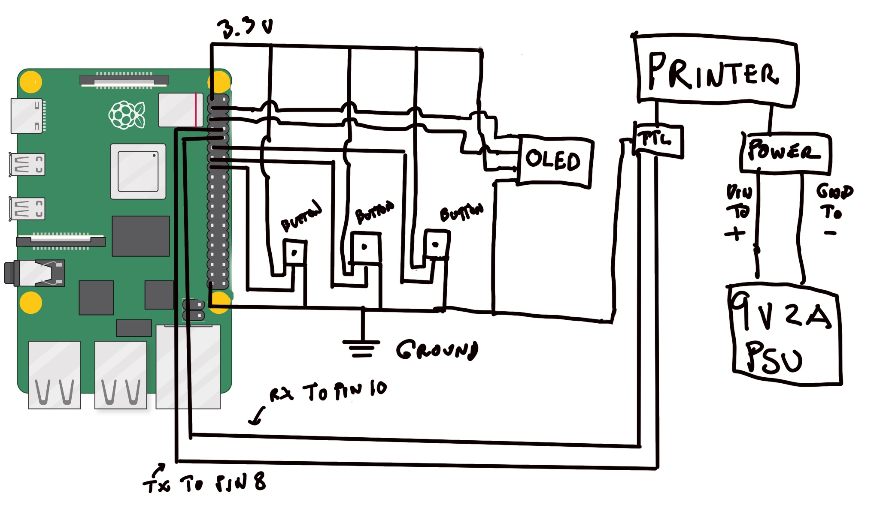

# Momir Basic Thermal Printer

A Raspberry Pi-powered thermal printer that plays [Momir Basic](https://mtg.fandom.com/wiki/Momir_Basic): press a button to set your mana value, then print a random creature card at that cost.



> **Note:** The wiring diagram above was made with a Raspberry Pi 4. The GPIO pinout is identical on the Raspberry Pi Zero 2 W — the same connections apply.

---

## How it works

1. Download the full card database (`AtomicCards.json`) from [MTGJSON](https://mtgjson.com)
2. Query the [Scryfall API](https://scryfall.com/docs/api) for creature card image URLs
3. Download card images and convert them to monochrome BMP for the thermal printer
4. Run `momir_basic.py` on the Pi: use two buttons to set the CMC, press a third to print a random card

---

## Hardware

| Qty | Component |
|-----|-----------|
| 1 | Raspberry Pi 4 (or Raspberry Pi Zero 2 W) |
| 1 | QR204 Thermal Printer |
| 1 | 0.91" OLED 128×32 I²C display (SSD1306) |
| 3 | KY-004 push button |
| 3 | 1 kΩ resistor *(optional — extends button lifetime; place between 3.3 V and the button)* |
| 1 | 12 V female 2.1 mm × 5.5 mm DC power jack adapter |
| 1 | 9 V 2 A male DC power adapter |
| 1 | Power cable for the Raspberry Pi |
| 1 | Soldering breadboard |
| 1 | 32 GB micro SD card |
| — | Dupont cables |

---

## Wiring

All pins use BOARD numbering (physical pin numbers, not BCM GPIO numbers).

| Component | Pi physical pin | Notes |
|-----------|----------------|-------|
| Button UP (increase CMC) | Pin 11 | Pull-down via PUD_DOWN; button connects pin to 3.3 V |
| Button DOWN (decrease CMC) | Pin 13 | Same wiring |
| Button PRINT | Pin 15 | Same wiring |
| OLED SDA | Pin 3 (SDA1) | I²C address 0x3C |
| OLED SCL | Pin 5 (SCL1) | |
| OLED VCC | Pin 1 (3.3 V) | |
| OLED GND | Pin 6 (GND) | |
| Thermal printer TX | Pin 8 (UART TX) | `/dev/serial0`, 9600 baud |
| Thermal printer RX | Pin 10 (UART RX) | |
| Thermal printer GND | GND | Shared ground with Pi |
| Thermal printer VH | 9 V supply | Separate from Pi power |

> The GPIO pinout is the same on all 40-pin Raspberry Pi models (Pi 3, Pi 4, Pi Zero 2 W, etc.).

---

## Prerequisites

- Python 3 with the packages listed in `requirements.txt` (`ijson` 3 or later is required):
  ```bash
  pip install -r requirements.txt
  ```
  On Raspberry Pi OS Bookworm and later, `pip` refuses to install system-wide
  (PEP 668): use a virtual environment (`python3 -m venv --system-site-packages .venv`),
  or add `--break-system-packages`. If you use a virtual environment, run
  `momir_basic.py` with `.venv/bin/python` (also in the crontab entry below).
- `curl` and `gunzip`
- The I²C bus and the hardware serial port enabled (`sudo raspi-config` →
  *Interface Options*): **I2C** on, **Serial Port** → login shell *off*,
  serial hardware *on*. Reboot afterwards.

---

## Setup

### 1. Clone the repository

```bash
git clone https://github.com/arthur-lagenebre/momir_thermal_printer.git
cd momir_thermal_printer
```

### 2. Configure paths

Copy the settings template and edit it for your setup:

```bash
cp settings.cfg.example settings.cfg
```

`settings.cfg` is excluded from version control (`.gitignore`). Edit it:

```ini
[DEFAULT]

# Directory where card images are stored (one sub-folder per CMC value)
IMAGES_DIR=/home/pi/Desktop/momir

# Directory for intermediate data files (AtomicCards.json, creatures_image_urls.json)
DATA_DIR=/home/pi/momir_data

# Path to the TrueType font used by the OLED display
FONT_PATH=/home/pi/momir_thermal_printer/assets/FredokaOne-Regular.ttf
```

### 3. Download and convert card images

```bash
./scripts/update.sh
```

This single script:
1. Downloads the latest `AtomicCards.json` from MTGJSON
2. Queries Scryfall for creature image URLs
3. Downloads only **new** images (cards already converted to BMP are skipped; failed downloads are retried, and reported at the end)
4. Converts new JPGs to monochrome BMP in parallel using all CPU cores
5. Cleans up temporary files: the downloaded JPGs, `AtomicCards.json` and `creatures_image_urls.json` are deleted once converted

Re-run `update.sh` whenever a new Magic set is released to fetch new cards only.

### 4. Run on startup

Add `momir_basic.py` to crontab so it starts automatically when the Pi boots:

```bash
crontab -e
```

Add the following line:

```
@reboot python3 /home/pi/momir_thermal_printer/momir_basic.py
```

---

## File reference

```
.
├── momir_basic.py                      Main program (runs on the Pi)
├── settings.cfg.example                Configuration template
├── scripts/                            Card database / image preparation
│   ├── update.sh
│   ├── get_image_urls_from_scryfall.py
│   ├── download_images_from_scryfall.py
│   └── convert_images.py
└── assets/
    ├── FredokaOne-Regular.ttf
    └── wiring.jpg
```

| File | Description |
|------|-------------|
| `momir_basic.py` | Main program: runs on the Pi, reads buttons, drives the OLED and thermal printer |
| `requirements.txt` | Python dependencies (`pip install -r requirements.txt`) |
| `settings.cfg.example` | Configuration template — copy to `settings.cfg` (at the repository root) and set your paths |
| `scripts/update.sh` | All-in-one update script: download, fetch URLs, download images, convert to BMP |
| `scripts/get_image_urls_from_scryfall.py` | Queries the Scryfall API and writes `creatures_image_urls.json` |
| `scripts/download_images_from_scryfall.py` | Downloads card images in parallel; skips cards already converted |
| `scripts/convert_images.py` | Converts downloaded JPGs to 384 px wide monochrome BMPs (Pillow, parallel) |
| `assets/FredokaOne-Regular.ttf` | Font used by the OLED display |
| `assets/wiring.jpg` | Wiring reference diagram |
